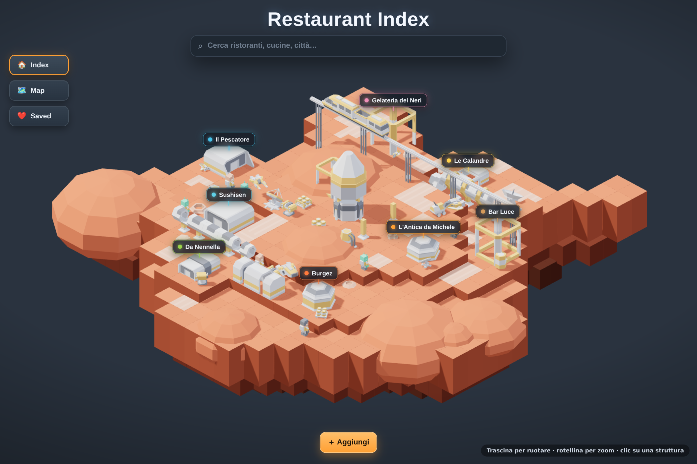

# Place Index

Mappa a schermo intero dove segni i posti che ti interessano. Di mappe puoi averne quante
vuoi — i ristoranti, un viaggio, le case viste — e ognuna ha i suoi posti e i suoi gruppi. Ogni
posto appartiene a una categoria, che gli dà emoji e colore, e può stare in quanti gruppi vuoi.
Niente categorie preimpostate, niente fronzoli.



## Cosa fa

- **Mappa full-screen** (Leaflet + tile OpenStreetMap, nessuna API key).
- **Più mappe**: il nome in alto a sinistra le cambia e ne crea di nuove. Una mappa è un indice
  a sé — i suoi posti, i suoi gruppi — mentre le categorie sono tue e valgono su tutte. Una è
  **selezionata** (è lì che finisce quello che aggiungi); le altre le accendi con l'occhio e i
  loro pin compaiono accanto ai suoi, con l'indice che dice da quale mappa viene ogni riga.
- **Link pubblici**: ogni mappa si può pubblicare a `/u/<il-tuo-nome>/<indirizzo>`, e tutte
  quelle pubblicate stanno insieme in `/u/<il-tuo-nome>` — quello è il link da mettere in bio.
  Siccome l'indirizzo sta sotto il tuo nome, la tua "pizzerie" non toglie il posto a quella di
  nessun altro. I vecchi link `/m/<indirizzo>` rispondono ancora e si correggono da soli. I
  posti segnati privati restano fuori (sulla mappa portano un lucchetto), e da fuori la pagina
  è di sola lettura, con l'elenco dei posti di lato. Anche lì c'è il tasto "dove sono": chi apre
  il link mentre gira per quella città vede il puntino, e l'elenco si riordina dal più vicino
  con le distanze.
- **Quante volte è stato usato un link**: sotto ogni indirizzo, nella scheda delle mappe, due
  numeri — *aperture* (quante volte il link è stato usato, scartando le ricariche dei primi
  cinque minuti) e *persone* (quante impronte diverse in una giornata). Più la provenienza: per
  una mappa quante di quelle aperture venivano dal profilo, per il profilo quante persone hanno
  poi aperto una mappa. Il metodo è quello delle statistiche senza banner (Plausible e simili):
  l'impronta è un hash di indirizzo IP e browser mescolati a un **sale che cambia ogni giorno**,
  vive in memoria, non tocca mai il disco, e al riavvio si dimentica tutto. Niente cookie sulla
  pagina pubblica, quindi niente consenso da chiedere — in cambio, dalla stessa rete con lo
  stesso browser sei sempre la stessa persona, anche in incognito. Le visite fatte mentre sei
  entrato nel tuo account non contano, e chi guarda la pagina pubblica quei numeri non li vede.
- **Aggiungi posto**: premi il bottone, clicca il punto sulla mappa (il pin si può trascinare),
  dai nome, categoria, gruppo e note. Un posto può essere segnato **privato**. Il pin compare subito: il salvataggio viaggia dietro, e se
  il server rifiuta la riga torna indietro da sola.
- **⌘K**: una sola casella che cerca prima tra i *tuoi* posti — per nome, categoria, gruppo o
  note — e poi tra gli indirizzi di OpenStreetMap. Frecce per muoverti, Invio per aprire. Da un
  indirizzo nasce un posto nuovo col form già compilato.
- **Gruppi**: filtro a parte dalle categorie, e un posto ne porta quanti ne vuoi — la stessa
  pizzeria può stare in "Padova" e in "Da rifare". Scegli un gruppo e la mappa ci vola, i
  conteggi delle categorie si ricalcolano dentro quel gruppo: *pizzeria a Padova* è due clic.
- **L'indice nel pannello**, in due modi. *In vista*: i posti inquadrati in quel momento, dal
  più vicino. *Vicino a me*: i tuoi posti più vicini **ovunque siano**, che è quello che serve
  in strada — sei a Porta Romana, i posti buoni sono a Brera, e la lista non è più vuota. Il
  tasto sopra allo zoom chiede al browser dove sei: compare il puntino con il suo alone e le
  distanze partono da lì (l'intestazione dice *da dove sei* invece di *dal centro*, e il centro
  è quel cerchietto chiaro in mezzo alla mappa). Senza permesso — o senza https — si misura dal
  centro di quello che stai guardando. Passi sopra una riga e il suo pin si solleva; ci clicchi
  e la mappa ci vola aprendo la scheda.
- **Cluster**: quando i pin si accavallano diventano un disco che porta i colori delle
  categorie che contiene, e si apre allo zoom.
- **Categorie**: le crei tu, con emoji scelta da un picker completo e un colore. Eliminare una
  categoria elimina anche i suoi posti; eliminare un gruppo invece li lascia dove sono, meno
  quell'etichetta.
- **Niente finestre di conferma**: quel che elimini sparisce subito, con sei secondi di
  "Annulla" nel toast. Solo allo scadere la cancellazione parte davvero.
- **Si entra con email, password e nome utente** (quello del link pubblico: si propone da sé
  dall'email), e un accesso se lo crea chiunque. Ognuno ha il suo indice: le sue mappe, le sue
  categorie, i suoi agenti. I dati stanno tutti in un `places.json` sul server.
- **Una mappa si può tenere in due.** Nelle sue chiavi (`PlaceMap.editors`) metti degli
  indirizzi email: chi e' in quell'elenco entra in quella mappa e ci lavora *come te* — aggiunge
  luoghi, cambia categorie, installa agenti, accende le luci. Non e' un permesso a meta': o tutta
  la mappa, o niente. Le tue altre mappe non le vede. Servono degli indirizzi e non un link,
  perche' un link non dice chi sei. Mentre ci si trova dentro, una fascia in alto dice sempre di
  chi sono le mappe che si stanno toccando.
- **Le scene**: piu' cose che partono insieme, ognuna con la sua azione. «Sera» chiude le tende e
  accende l'abat-jour — due azioni diverse su due cose diverse, premute una volta. Premerle a
  mano una per volta si vede: partono a mezzo secondo di distanza. Una scena non e' un
  dispositivo finto e non ha uno stato: due tende possono stare una aperta e una chiusa, e per
  quello non c'e' una parola sola. Le righe partono in parallelo, e chi non risponde si dice con
  il suo nome.
- **Il registro di un agente**: le ultime ventiquattr'ore di quella casa, in italiano. Si e'
  collegato, cosa ha mosso e chi ha premuto, cosa ha smesso di rispondere e quando. Non ci
  finisce ogni cambiamento di stato — una sonda che manda un grado ogni dieci secondi
  coprirebbe tutto il resto: ci finisce quello che e' successo *una volta*. Le righe piu'
  vecchie di un giorno se ne vanno da sole, alla prima che si scrive.
- **Le telecamere si guardano, non si comandano.** Una telecamera che Home Assistant conosce
  arriva qui come un dispositivo con una capacita' `image`: al posto degli interruttori mostra
  l'ultima immagine, che si rifa' ogni cinque secondi mentre la stai guardando e si ferma appena
  esce dallo schermo o la scheda passa in secondo piano. Non e' un video: ogni fotogramma e' una
  domanda che va fino a casa, e la' dentro Home Assistant deve aspettare un fotogramma chiave
  prima di poter disegnare qualcosa. Non finisce nel registro — guardare non e' successo niente —
  e **agli ospiti di una mappa non si mostra**: chi ha la chiave puo' accendere le luci, ma una
  telecamera non e' una lampadina.
- **Le mappe hanno la loro pagina** (`/maps`), come gli agenti: una mappa non e' una voce
  d'elenco come una categoria — ha un indirizzo pubblico, dei conteggi, e sotto ognuna chi la puo'
  modificare con le sue regole. In una colonna da trecento pixel diventava una cosa che scorreva.
  Ci si arriva dal menu delle mappe, «Condividi e gestisci».
- **Le regole stanno sulla persona, non sul pin.** Ogni indirizzo nell'elenco di una mappa puo'
  averla tutta, oppure solo certi luoghi: «questi tre a lui, tutti a lei» si decide in un posto
  solo, e si puo' dire diverso a persone diverse. Gli altri luoghi si vedono — stanno sulla
  mappa, sarebbe strano sparissero — ma non si toccano, e chi e' limitato non ne aggiunge di
  nuovi: nascerebbero fuori dal suo elenco.
- **Tutto quello che cambia scende dal filo aperto**, non solo i luoghi: mappe, categorie,
  gruppi, scene, agenti, dispositivi, il registro. E le regole di una mappa — se te le cambiano
  mentre ci stai lavorando dentro, la pagina rilegge il proprio raggio invece di offrirti tasti
  che il server rifiuterebbe; se te le tolgono, torna a casa tua dicendotelo.

## Il front-end

Svelte 5 in TypeScript, con Vite. La mappa resta imperativa — Leaflet vuole
comandare il suo DOM — e tutto il resto è dichiarativo intorno a lei:

| cartella | cosa tiene |
| --- | --- |
| `src/lib/store.svelte.ts` | lo stato dell'indice e le scritture: ottimistiche, con rollback, e le cancellazioni con la finestra di undo |
| `src/lib/ui.svelte.ts` | quale pannello è aperto, cosa sta modificando, quale popover è in ballo |
| `src/lib/mapBridge.svelte.ts` | la cucitura con Leaflet: i pannelli chiedono "vola qui", la mappa pubblica dove si trova |
| `src/lib/` (resto) | `api`, `types`, `format`, `popover`, `storage`, `toast` |
| `src/components/` | un file per pezzo di interfaccia: pannello, lista, sheet, palette, popover, toast |

Lo stato vive in classi con le rune (`$state`), quindi le stesse regole valgono
ovunque: un posto salvato compare subito perché la lista, i marker e i conteggi
leggono tutti la stessa cosa.

Globali restano solo le fondamenta — i token, il reset con la superficie in
vetro, i campi, i keyframe e la pelle di Leaflet (`styles/map.css`, perché pin,
grappoli e popup nascono fuori da Svelte). Tutto il resto sta nel componente che
lo disegna, e quello che ricorre è diventato un pezzo solo: `Button` (con le sue
varianti: primary, ghost, icon, link, danger), `Switch`, `Chip`, `AddRow`,
`LinkRow`, `Stop`, `Alert`. Chi li usa passa dei dati — `look="primary"`,
`disabled` — invece di ricordarsi una classe.

## Chi entra

Passport con strategia JWT, e il token in un cookie `httpOnly`: nessuno script della pagina
può leggerlo, e il browser lo riporta da solo. La password non si conserva — si conserva una
derivata `scrypt` col suo sale, e il confronto è a tempo costante.

- **Le iscrizioni sono aperte**: chiunque si crea un accesso, e ognuno vede solo il proprio
  indice. Se lo pubblichi su internet e vuoi restare in pochi, chiudile con
  `ALLOW_SIGNUP=false` dopo esserti registrato.
- **Le chiavi si controllano a ogni richiesta**, non quando si entra: il cookie dice soltanto in
  casa di chi sei, e se la chiave e' stata tolta un minuto fa la richiesta dopo sei di nuovo a
  casa tua. Quasi tutto il server non sa nemmeno che la cosa esista: la differenza vive in
  `scopeOf`, che dice di chi e' l'indice e quali delle sue mappe questa richiesta puo' toccare.
- **Email sconosciuta e password sbagliata danno lo stesso errore**: chi prova non deve capire
  quale dei due ha indovinato.
- **Tutto `/api` è protetto** tranne le quattro rotte d'ingresso, e un rifiuto arriva come
  `401 { error }`, non come pagina.
- **Il segreto**: `JWT_SECRET` dall'ambiente. Se manca, ne viene generato uno e tenuto accanto
  ai dati (`jwt.secret`, permessi 600), altrimenti ogni riavvio butterebbe fuori tutti.

La schermata d'ingresso è la mappa con due tappe: un pin per l'email, uno per la password,
uniti da un tratteggio.

## Quello che si vede da fuori

Due indirizzi pubblici, entrambi senza login:

- `/m/<indirizzo>` — una mappa pubblicata, in sola lettura: pin, schede, indicazioni.
- `/u/<nome>` — tutte le mappe pubblicate di una persona, con quanti posti hanno.

Una mappa nasce **non pubblicata**. Quando la pubblichi escono solo i posti non privati, e con
loro solo le categorie e i gruppi che quei posti usano davvero: niente tassonomia inutilizzata,
niente email, niente id di cose che non si vedono. L'indirizzo lo puoi scegliere, e resta unico
fra tutte le mappe; il tuo nome nel profilo nasce dalla tua email e resta unico fra le persone.

## Il backend

Express in TypeScript, a livelli, ognuno con un mestiere solo:

| livello | cosa fa | esempio |
| --- | --- | --- |
| **controller** | solo HTTP: status, body, `try/catch` verso il gestore errori | `PlaceController` |
| **service** | orchestra il caso d'uso e mappa le entità nelle view | `PlaceService` |
| **manager** | regole di dominio, e apre **una transazione** per metodo | `PlaceManager` |
| **repository** | accesso ai dati dentro la transazione | `PlaceRepository` |
| **DTO** | cosa può entrare, validato con `class-validator` | `CreatePlaceDto` |

- **Validazione**: un middleware trasforma il body in istanza DTO e ci fa girare
  `class-validator`; a un controller arriva solo roba già valida. Quando un campo rompe più
  regole insieme, l'errore restituito è quello più fondamentale ("il nome è obbligatorio", non
  "troppo lungo").
- **Transazioni**: `JsonStore.transaction()` dà al lavoro una copia privata dei dati e scrive su
  disco solo se arriva in fondo — un'eccezione a metà è un rollback. Le transazioni sono
  serializzate, quindi due richieste non si sovrascrivono. La scrittura passa per un file
  vicino e una `rename`, così un crash non lascia mezzo file.
- **Chi possiede cosa**: le mappe e le categorie sono dell'account, i gruppi e i posti stanno
  dentro una mappa. Ogni lettura e ogni scrittura passano da lì, così la mappa di un altro
  semplicemente non esiste. Un account senza mappe non esiste: la prima nasce da sola, e
  l'ultima non si può cancellare.
- **Invarianti di dominio** (una categoria si porta via i suoi posti, un gruppo cancellato si
  limita a sfilarsi dai posti che lo portavano, un posto non può puntare a id inesistenti)
  stanno nei manager, dentro la stessa transazione. I record scritti quando un posto poteva
  stare in un solo gruppo vengono convertiti alla lettura, e riscritti alla prima modifica.

## Pubblicare con Docker

```bash
docker compose up -d --build
```

Poi apri <http://localhost:8080>. I dati finiscono nel volume `place-index-data` montato su `/data`.

Senza compose:

```bash
docker build -t place-index .
docker run -d --name place-index -p 8080:8080 -v place-index-data:/data place-index
```

Per tenere i dati in una cartella del host invece che in un volume:
`-v /percorso/sul/host:/data`.

Variabili d'ambiente:

| variabile | default | a cosa serve |
| --- | --- | --- |
| `PORT` | `8080` | la porta su cui ascolta |
| `DATA_DIR` | `/data` nell'immagine | dove vivono `places.json` e il segreto |
| `JWT_SECRET` | generato e salvato | con che cosa si firmano i token |
| `JWT_TTL_DAYS` | `30` | quanto dura una sessione |
| `ALLOW_SIGNUP` | `true` | se altri possono crearsi un accesso |

> Dietro un reverse proxy con HTTPS il cookie diventa `secure` da solo: l'app si fida
> dell'intestazione `X-Forwarded-Proto`.

## Sviluppo

```bash
npm install
npm run dev     # tsx watch sull'API (:8080) + Vite (:5173) che le fa da proxy
```

| script | cosa fa |
| --- | --- |
| `npm run dev` | API in watch e front-end insieme |
| `npm run build` | `vite build` in `dist/`, poi `tsc` in `server/dist/` |
| `npm run typecheck` | i tipi del server, niente output |
| `npm start` | serve API e front-end compilati dallo stesso processo |

## L'interfaccia

Tutta la UI è un solo strato di pannelli in vetro sopra la mappa: un'unica scala tipografica
(Inter, servito in locale), una scala di ombre, una di raggi, una di z-index. La mappa è
desaturata via CSS così l'unico colore acceso sullo schermo è un marker. Tema chiaro e scuro
seguono il sistema (`prefers-color-scheme`), incluse le tile, e le animazioni si spengono con
`prefers-reduced-motion`. Niente font, icone o dati emoji presi da una CDN: tutto è nel bundle
([Inter](https://fontsource.org/fonts/inter), [Lucide](https://lucide.dev),
[emoji-picker-element](https://github.com/nolanlawson/emoji-picker-element)).

Lo stile sta in `src/styles/`, un file per area, caricati in quest'ordine da `index.css`:

| file | cosa tiene |
| --- | --- |
| `tokens.css` | colori, inchiostri, ombre, z-index, geometria — e i loro gemelli scuri |
| `base.css` | reset, cornice di pagina, la superficie in vetro, i due stili di testo |
| `controls.css` | campi, bottoni, chip, bottone emoji, pastiglia del colore |
| `panel.css` | il pannello sinistro: ricerca, filtri, indice |
| `sheets.css` | le sheet di destra, le loro schede e il popover delle emoji |
| `map.css` | pin, cluster, popup e il chrome di Leaflet ridisegnato |
| `palette.css` | la palette ⌘K |
| `hud.css` | bottone aggiungi, pill del suggerimento, toast |
| `animations.css` | tutti i keyframe, e l'interruttore che li spegne |

Ogni file si porta dietro le proprie regole per lo schermo stretto: non c'è un file
"responsive" separato da tenere allineato.

## API

| Metodo | Rotta | Note |
| --- | --- | --- |
| `GET` | `/api/auth/state` | pubblica: dice se c'è già qualcuno e se ci si può iscrivere |
| `GET` | `/api/public/m/:slug` | pubblica: una mappa pubblicata, senza i posti privati |
| `GET` | `/api/public/u/:handle` | pubblica: le mappe pubblicate di una persona |
| `POST` | `/api/auth/register` `/api/auth/login` | `{ email, password }`, rispondono col cookie |
| `POST` `GET` | `/api/auth/logout` `/api/auth/me` | uscire, e sapere chi si è |
| `GET` | `/api/state` | `{ maps, categories, groups, places }`: da qui parte il client |
| `GET` `POST` | `/api/categories` | `{ name, emoji?, color? }` |
| `PUT` `DELETE` | `/api/categories/:id` | la cancellazione porta via anche i posti della categoria |
| `GET` `POST` | `/api/groups` | `{ mapId, name }` |
| `PUT` `DELETE` | `/api/groups/:id` | la cancellazione sfila l'etichetta dai posti, non li elimina |
| `GET` `POST` | `/api/maps` | `{ name }` |
| `PUT` `DELETE` | `/api/maps/:id` | accetta anche `{ slug, published }`; cancellarla porta via i suoi gruppi e posti, e l'ultima resta |
| `GET` `POST` | `/api/places` | `{ mapId, name, categoryId, groupIds?, lat, lng, note?, private? }` |
| `PUT` `DELETE` | `/api/places/:id` | il `PUT` è parziale: manda solo i campi che cambiano |

Gli errori arrivano come `{ error, details? }`: `400` per un DTO non valido o un riferimento
inesistente, `401` se non sei entrato, `404` per un id che non c'è.
